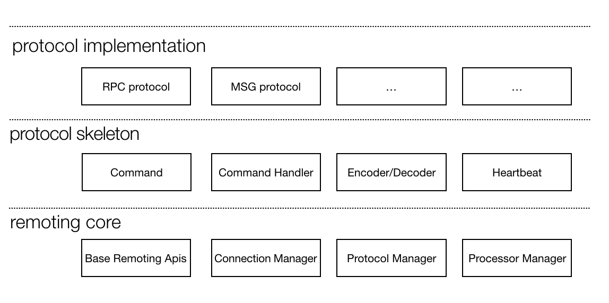
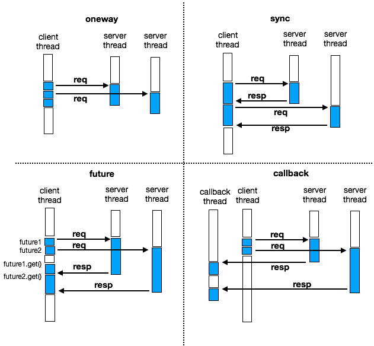
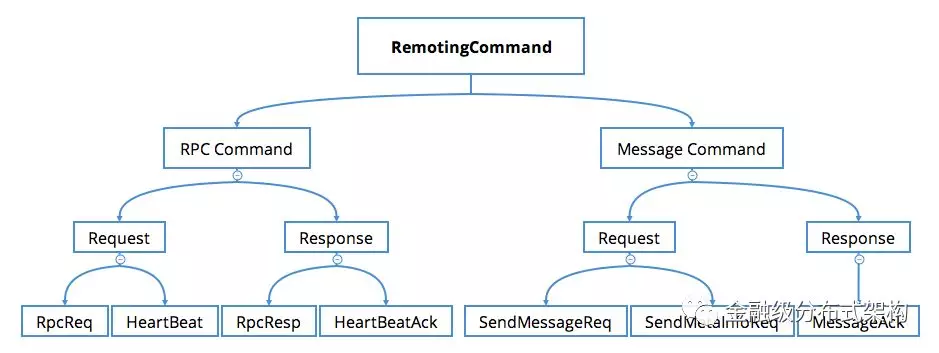

# SOFABolt Project

# 1. 介绍
SOFABolt 是蚂蚁金融服务集团开发的一套基于 Netty 实现的网络通信框架。
* 为了让 Java 程序员能将更多的精力放在基于网络通信的业务逻辑实现上，而不是过多的纠结于网络底层 NIO 的实现以及处理难以调试的网络问题，Netty 应运而生。
* 为了让中间件开发者能将更多的精力放在产品功能特性实现上，而不是重复地一遍遍制造通信框架的轮子，SOFABolt 应运而生。

Bolt 名字取自迪士尼动画-闪电狗，是一个基于 Netty 最佳实践的轻量、易用、高性能、易扩展的通信框架。
这些年我们在微服务与消息中间件在网络通信上解决过很多问题，积累了很多经验，并持续的进行着优化和完善，我们希望能把总结出的解决方案沉淀到 SOFABolt 这个基础组件里，让更多的使用网络通信的场景能够统一受益。
目前该产品已经运用在了蚂蚁中间件的微服务 ([SOFARPC](https://github.com/alipay/sofa-rpc))、消息中心、分布式事务、分布式开关、以及配置中心等众多产品上。

# 2. 功能介绍

## SOFABolt　的基础功能包括：
* 基础通信功能 ( remoting-core )
    * 基于 Netty 高效的网络 IO 与线程模型运用
    * 连接管理 (无锁建连，定时断链，自动重连)
    * 基础通信模型 ( oneway，sync，future，callback )
    * 超时控制
    * 批量解包与批量提交处理器
    * 心跳与 IDLE 事件处理
* 协议框架 ( protocol-skeleton )
    * 命令与命令处理器
    * 编解码处理器
    * 心跳触发器
* 私有协议定制实现 - RPC 通信协议 ( protocol-implementation )
    * RPC 通信协议的设计
    * 灵活的反序列化时机控制
    * 请求处理超时 FailFast 机制
    * 用户请求处理器 ( UserProcessor )
    * 双工通信
    
## 用法1
将 SOFABolt 用作一个远程通信框架，使用者可以不用关心如何实现一个私有协议的细节，直接使用我们内置的 RPC 通信协议。可以非常简单的启动客户端与服务端，同时注册一个用户请求处理器，即可完成远程调用。同时，像连接管理、心跳等基础功能特性都默认可以使用。
当前支持的调用类型如下图所示：

* 示例 Demo 请参考我们的 [用户手册](https://github.com/alipay/sofa-bolt/wiki/SOFA-Bolt-Handbook#14-%E5%9F%BA%E7%A1%80%E9%80%9A%E4%BF%A1%E6%A8%A1%E5%9E%8B)

## 用法2
将 SOFABolt 用作一个协议框架，使用者可以复用基础的通信模型、协议包含的接口定义等基础功能。然后根据自己设计的私有协议自定义 Command 类型、Command 处理器、编解码处理器等。如下图所示，RPC 和消息的 Command 定义结构：

# 4. 如何贡献
开放代码允许在签署协议之后,提交贡献代码.
具体参考[如何参与贡献 SOFABolt 代码](./CONTRIBUTING.md)

# 5. 版权协议
对 SOFABolt 代码的修改和变更，需要遵守[版权协议](./LICENSE)

# 6. 有用的链接
* [ISSUES](https://github.com/alipay/sofa-bolt/issues)
* [用户手册](https://github.com/alipay/sofa-bolt/wiki/SOFA-Bolt-Handbook)
* [中文介绍文章: 蚂蚁通信框架实践](http://mp.weixin.qq.com/s/JRsbK1Un2av9GKmJ8DK7IQ)